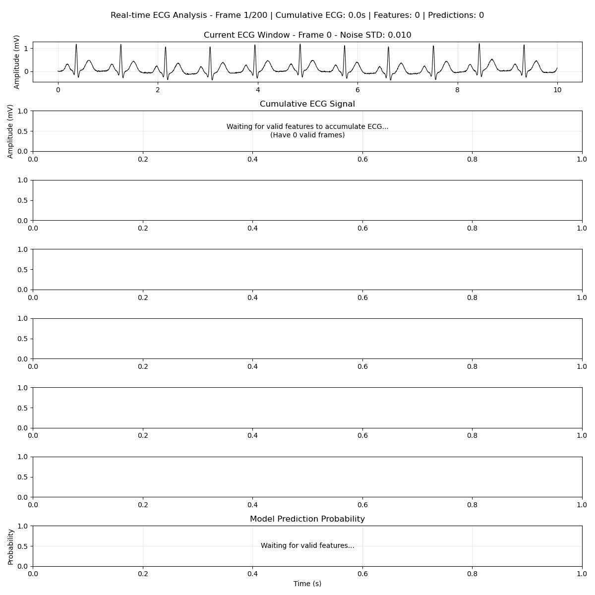

# Real-Time ECG Signal Analysis and Classification

Advanced Python implementation for ECG signal processing, feature extraction, and machine learning-based classification with progressive noise simulation and real-time visualization.



## Table of Contents

1. [Introduction](#introduction)
2. [Dependencies](#dependencies)
3. [Installation](#installation)
4. [Usage](#usage)
5. [Features](#features)
6. [Algorithm](#algorithm)
7. [Results](#results)
8. [Important Notes](#important-notes)
9. [Contact](#contact)

## Introduction

This repository provides comprehensive tools for ECG signal analysis, designed to evaluate algorithm robustness under varying noise conditions. The system generates realistic ECG signals, applies progressive noise testing, and provides real-time feedback through animated visualizations.

## Dependencies

To run this project, you'll need to have the following dependencies installed:

- **NumPy** (Version 1.23.5)
- **Pandas** (Version 2.2.3)
- **Matplotlib** (Version 3.9.4)
- **SciPy** (Version 1.10.1)
- **Neurokit2** (Version 0.2.5)

You can install these dependencies using pip:

```bash
pip install -r requirements.txt
```

## Installation

1. Clone or download this repository to your local machine
2. Install the required dependencies (see Dependencies section above)
3. Ensure you have the pre-trained TensorFlow model in the ./model/ directory

## Usage

To use this code, follow these steps:

1. Ensure you have the required dependencies installed
2. Clone or download this repository to your local machine
3. Run the Python script:

```bash
python animation_real_time_with_SNR.py
```

This script will generate an animated plot showing the ECG signal analysis in real-time.

**Output Files:**
- ecg_analysis_animation.mp4 - High-quality MP4 animation (if FFmpeg available)
- ecg_analysis_animation.gif - Fallback GIF animation (if Pillow available)
- Console output with detailed analysis statistics

## Features

### Core Capabilities
- **Realistic ECG Simulation**: Generates physiologically accurate ECG signals with natural heart rate variations
- **Progressive Noise Testing**: Implements comprehensive noise schedule to test algorithm robustness (0.01 to 2.00 STD)
- **Real-time Processing**: Extracts features from 30-second sliding windows using cumulative signal processing
- **7-Panel Real-time Visualization**: Creates comprehensive animated visualizations of the entire ECG analysis pipeline

### Advanced Signal Processing
- Bandpass filtering (0.25-30 Hz) with ECG cleaning
- R-peak detection using NeuroKit2 advanced algorithms
- Multi-component noise simulation including Gaussian noise, high-frequency muscle artifacts, and low-frequency baseline wander
- Heart rate variability (RMSSD) calculation with outlier removal
- Real-time signal-to-noise ratio (SNR) computation

### Visualization Components
The animation provides 7 synchronized subplots:
1. Current ECG window display (10-second tail)
2. Cumulative ECG signal timeline with highlighted current segment
3. Real-time Signal-to-Noise Ratio tracking (0-30 dB range)
4. Mean heart rate trends with 70 BPM reference line
5. Maximum heart rate values over time
6. Minimum heart rate values over time
7. Heart rate variability (RMSSD) showing cardiac autonomic function

## Algorithm

### Signal Generation Process
The system generates realistic ECG signals incorporating:
- Base heart rate of 70 BPM with natural individual variations
- Respiratory sinus arrhythmia (breathing-induced heart rate changes)
- Long-term trends simulating activity or stress effects
- Random walk components for physiological drift

### Progressive Noise Schedule
Implements sophisticated noise testing:
- Frames 0-20: Clean signal (0.01 STD)
- Frames 20-50: Low noise (0.05 STD)
- Frames 50-75: Moderate noise (0.15 STD)
- Frames 75-100: High noise (0.30 STD)
- Frames 100-200: Extreme noise testing (0.45-1.00 STD)
- Extended runs (200+): Stress testing up to 2.00 STD with gradual recovery phases

### Feature Extraction Pipeline

#### Step 1 — Signal Filtering & Cleaning
The raw ECG is processed through two sequential steps before any feature extraction:

```
Raw ECG
  │
  ▼
Butterworth Bandpass Filter (4th order, 0.25 – 30 Hz)
  │  Removes baseline wander (<0.25 Hz) and high-frequency EMG noise (>30 Hz)
  ▼
NeuroKit2 ecg_clean()
  │  Applies additional signal conditioning and amplitude normalisation
  ▼
Cleaned ECG  ──────────────────────────────────────────────┐
  │                                                         │ (used later for SNR)
  ▼                                                         │
R-peak Detection  (engzeemod2012 algorithm)                 │
```

#### Step 2 — R-peak Detection and RR Intervals

The Engzee-Modified (2012) algorithm locates each R-peak in the cleaned signal. R-peaks are the sharp, high-amplitude spikes of the ECG complex:

```
Amplitude (mV)
  │         R                       R                       R
  │        /|\                     /|\                     /|\
  │       / | \                   / | \                   / | \
  │   P  /  |  \ T           P  /  |  \ T           P  /  |  \ T
  │  /\ /   |   \/\         /\ /   |   \/\         /\ /   |   \/\
  │ /  V    |    \ \/\/\   /  V    |    \ \/\/\   /  V    |    \
──┼─────────┼─────────────────────┼─────────────────────┼──────────▶ time (s)
             t₁                    t₂                    t₃

  │←── RR₁ = t₂ − t₁ ──────────▶│←── RR₂ = t₃ − t₂ ──────────▶│

  Heart Rate (BPM) = 60 / RR interval
```

RR intervals are the time gaps between consecutive R-peaks. A 30-second window at 70 BPM yields ~35 RR intervals for statistics.

#### Step 3 — Outlier Rejection (z-score filter, threshold = 5.0)

Ectopic beats and detection artefacts produce anomalous RR values. These are removed with a z-score filter applied to both heart rate values and their successive differences (used for HRV):

```
Heart rate values:  [68, 71, 70, 145, 69, 72]
                                 ↑
                         z-score > 5.0  → rejected

Retained values:    [68, 71, 70,      69, 72]   ← used for HR mean/max/min

Successive RR diffs (ΔRR):  [3, 1, 75, 3]
                                     ↑
                             z-score > 5.0  → rejected

Retained ΔRR:       [3, 1,      3]            ← used for HRV (RMSSD)
```

A threshold of **5.0** is intentionally permissive — it removes only extreme physiological outliers while preserving real rate fluctuations that a stricter threshold (e.g. 2.0) would incorrectly discard under noisy conditions.

#### Step 4 — Heart Rate Statistics

From the filtered heart rate series:

| Feature  | Formula                          |
|----------|----------------------------------|
| HR mean  | mean(HR values) in BPM           |
| HR max   | max(HR values) in BPM            |
| HR min   | min(HR values) in BPM            |

#### Step 5 — Heart Rate Variability (HRV / RMSSD-like)

HRV quantifies beat-to-beat fluctuations and reflects autonomic nervous system activity:

```
RR intervals (ms):   [857, 833, 870, 847, 862, ...]
Successive diffs ΔRR: [  24,  37,  23,  15, ...]  (|RRₙ₊₁ − RRₙ|)
HRV = √( mean(ΔRR²) )   ← root mean square of successive differences
```

Higher HRV indicates healthy autonomic regulation; lower values appear under stress or noise degradation.

#### Step 6 — SNR Calculation via R-peak Windows

Signal-to-Noise Ratio is computed by comparing the raw noisy signal against the cleaned signal **inside a ±0.1 s window centred on every R-peak**:

```
ECG amplitude
  │                     ┌─────────────┐
  │                     │  SNR window │
  │                     │  (0.2 s)    │
  │               R-peak│             │
  │              ╱│╲    │             │
  │             ╱ │ ╲   │             │
  │  ─────────╱──┼──╲──┼─────────────┼────▶ time
  │           │  │   │  │             │
  │        −0.1s  t_R  +0.1s          │
  │                                   │
  │  raw (noisy):   ∿╱│╲∿∿∿   ← includes noise
  │  cleaned:        ╱ │ ╲    ← filtered reference
  │                 └──┴──┘
  │               extracted samples

  signal_power = var( raw_window )
  noise_power  = var( raw_window − cleaned_window )
  SNR (dB)     = 10 · log₁₀( signal_power / noise_power )
```

The ±0.1 s window (25 samples at 250 Hz per side, 50 samples total per beat) captures the full QRS complex and enough baseline on both flanks for a stable power estimate. A wider window (vs the previous ±0.05 s) reduces variance in the SNR estimate and makes it more robust under moderate noise.

#### Complete Feature Extraction Summary

```
Cleaned ECG (30 s window, 250 Hz)
  │
  ├─▶ R-peak times ──▶ RR intervals ──▶ z-filter ──▶ HR mean / max / min
  │                         │
  │                         └──▶ ΔRR ──▶ z-filter ──▶ HRV (RMSSD-like)
  │
  └─▶ ±0.1 s windows around each R-peak
           │
           ├── raw samples    ──▶ signal_power = var(raw)
           └── cleaned samples ──▶ noise_power  = var(raw − clean)
                                       │
                                       └──▶ SNR (dB) = 10·log₁₀(Ps/Pn)

Output feature vector: [ HR_mean, HR_max, HR_min, HRV, SNR ]
```

## Results

### Performance Expectations
The system provides comprehensive analysis with expected performance:
- **Clean Signal Performance**: >95% feature extraction success rate, SNR >20 dB
- **Moderate Noise Conditions**: 80-90% success rate, SNR 10-20 dB
- **High Noise Conditions**: 60-80% success rate, SNR 5-15 dB
- **Extreme Noise Conditions**: <60% success rate, SNR <10 dB

### Animation Output
The generated animation (ecg_analysis_animation.gif or .mp4) demonstrates:
- Real-time ECG signal processing under progressive noise conditions
- Feature extraction success rates across different noise levels
- Visual representation of algorithm robustness testing

### Analysis Features
The real-time visualization provides:
- Progressive noise level indicators
- Cumulative statistics display
- Visual parameter tracking across all 7 panels
- Interactive timeline showing ECG analysis evolution

The animated plot provides real-time insights into ECG signal analysis. You can observe changes in heart rate statistics, SNR degradation patterns, and heart rate variability trends as the simulation progresses through different noise conditions.

## Contact

**Project Maintainer**: Murat Kucukosmanoglu
**Email**: muratkosmanoglu@gmail.com

For any questions or inquiries, feel free to reach out for:
- Technical assistance with implementation
- Questions about the algorithm details
- Collaboration opportunities
- Bug reports or feature requests

Please do not hesitate to contact me if you have any feedback or need assistance with using the script.

---

*This project demonstrates advanced ECG signal processing techniques suitable for research, development, and educational purposes in cardiac signal analysis.*

