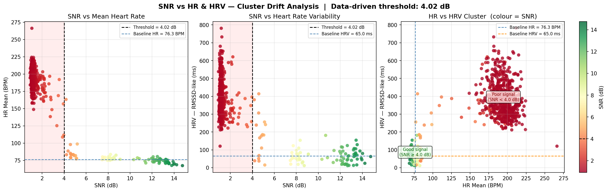

# Real-Time ECG Signal Analysis

Advanced Python implementation for ECG signal processing, feature extraction, and real-time visualization with progressive noise simulation.


## Table of Contents

1. [Introduction](#introduction)
2. [Citation](#citation)
3. [Dependencies](#dependencies)
4. [Installation](#installation)
5. [Usage](#usage)
6. [Features](#features)
7. [Algorithm](#algorithm)
8. [Results](#results)
9. [Contact](#contact)

## Introduction

This repository provides the signal processing and visualization pipeline used in the study of cognitive biotypes through ECG-derived workload markers. The system generates realistic ECG signals, applies progressive noise testing to evaluate algorithm robustness, and produces real-time animated visualizations alongside an automated SNR quality boundary analysis.

## Citation

This implementation was developed and applied in the following research:

> Conklin, S., Kargosha, G., Tu, J., Bansal, K., Dang, Q., Brooks, J., & Kucukosmanoglu, M. (2026). Cognitive biotypes identified through ECG-derived workload and behavioral accuracy. *Scientific Reports*. https://doi.org/10.1038/s41598-026-37107-8

If you use this code or methodology in your own work, please cite the paper above.

## Dependencies

- **NumPy** (Version 1.23.5)
- **Pandas** (Version 2.2.3)
- **Matplotlib** (Version 3.9.4)
- **SciPy** (Version 1.10.1)
- **Neurokit2** (Version 0.2.5)

```bash
pip install -r requirements.txt
```

## Installation

1. Clone or download this repository to your local machine
2. Install the required dependencies (see Dependencies section above)

## Usage

```bash
python main.py
```

This will run the full pipeline and produce two output files in the `assets/` directory:

| Output | Description |
|--------|-------------|
| `assets/ecg_analysis_animation.gif` | 8-panel real-time ECG animation (MP4 if FFmpeg is available) |
| `assets/snr_cluster_plot.png` | SNR vs HR & HRV cluster drift analysis |

Console output logs frame-by-frame processing progress and the data-driven SNR threshold.

## Features

### Core Capabilities
- **Realistic ECG Simulation**: Generates physiologically accurate ECG signals with natural heart rate variations
- **Progressive Noise Testing**: Implements comprehensive noise schedule to test algorithm robustness (0.01 to 2.00 STD)
- **Real-time Processing**: Extracts features from 30-second sliding windows using cumulative signal processing
- **Automated SNR Boundary Detection**: K-means clustering determines the signal quality threshold from the data itself
- **8-Panel Real-time Visualization**: Animated visualization of the entire ECG analysis pipeline
- **Signal Quality Metrics**: Flatline Ratio with automatic SNR zeroing (sourced from [physio-qc-toolkit](https://github.com/mkucukos/physio-qc-toolkit))

### Advanced Signal Processing
- Bandpass filtering (0.25–30 Hz) with ECG cleaning
- R-peak detection using NeuroKit2 (engzeemod2012 algorithm)
- Multi-component noise simulation: Gaussian noise, high-frequency muscle artifacts, and low-frequency baseline wander
- Heart rate variability (RMSSD-like) calculation with z-score outlier removal
- Real-time signal-to-noise ratio (SNR) computation via R-peak windows

### Visualization Components
The animation provides 8 synchronized subplots:
1. Current ECG window (10-second tail) — shaded red during flatline periods
2. Cumulative ECG signal timeline with highlighted current segment
3. Real-time SNR tracking (0–18 dB range) — drops to 0 on flatline detection
4. Mean heart rate with 70 BPM reference line
5. Maximum heart rate over time
6. Minimum heart rate over time
7. Heart rate variability (RMSSD-like)
8. Flatline Ratio (threshold 0.5)

## Algorithm

### Signal Generation Process
The system generates realistic ECG signals incorporating:
- Base heart rate of 70 BPM with natural individual variations
- Respiratory sinus arrhythmia (breathing-induced heart rate changes)
- Long-term trends simulating activity or stress effects
- Random walk components for physiological drift

### Progressive Noise Schedule

300 frames × 10 s = **3000 s total signal**. Two simulated flatline windows interrupt the escalation.

```
Frames   0– 20 : Clean signal            (0.01 STD)        seconds    0–  200
Frames  20– 65 : Gradual escalation      (0.03–0.12 STD)   seconds  200–  650
Frames  65– 95 : Moderate–high noise     (0.20–0.35 STD)   seconds  650–  950
Frames  95–100 : Pre-flatline peak       (0.35 STD)        seconds  950– 1000
Frames 100–120 : *** Flatline 1 ***      (SNR = 0)         seconds 1000– 1200
Frames 120–200 : Post-flatline peak      (0.50–2.00 STD)   seconds 1200– 2000
Frames 200–220 : *** Flatline 2 ***      (SNR = 0)         seconds 2000– 2200
Frames 220–300 : Gradual recovery        (1.60–0.10 STD)   seconds 2200– 3000
```

### Feature Extraction Pipeline

#### Step 1 — Signal Filtering & Cleaning

```
Raw ECG
  │
  ▼
Butterworth Bandpass Filter (4th order, 0.25 – 30 Hz)
  │  Removes baseline wander (<0.25 Hz) and high-frequency EMG noise (>30 Hz)
  ▼
NeuroKit2 ecg_clean()
  │  Applies additional signal conditioning and amplitude normalisation
  ▼
Cleaned ECG  ──────────────────────────────────────────────┐
  │                                                         │ (used later for SNR)
  ▼                                                         │
R-peak Detection  (engzeemod2012 algorithm)                 │
```

#### Step 2 — R-peak Detection and RR Intervals

```
Amplitude (mV)
  │         R                       R                       R
  │        /|\                     /|\                     /|\
  │       / | \                   / | \                   / | \
  │   P  /  |  \ T           P  /  |  \ T           P  /  |  \ T
  │  /\ /   |   \/\         /\ /   |   \/\         /\ /   |   \/\
  │ /  V    |    \ \/\/\   /  V    |    \ \/\/\   /  V    |    \
──┼─────────┼─────────────────────┼─────────────────────┼──────────▶ time (s)
             t₁                    t₂                    t₃

  │←── RR₁ = t₂ − t₁ ──────────▶│←── RR₂ = t₃ − t₂ ──────────▶│

  Heart Rate (BPM) = 60 / RR interval
```

A 30-second window at 70 BPM yields ~35 RR intervals for statistics.

#### Step 3 — Outlier Rejection (z-score threshold = 10.0)

```
Heart rate values:  [68, 71, 70, 145, 69, 72]
                                 ↑
                         z-score > 10.0  → rejected

Retained:           [68, 71, 70,      69, 72]   ← HR mean / max / min

Successive ΔRR:     [3, 1, 75, 3]
                             ↑
                     z-score > 10.0  → rejected

Retained ΔRR:       [3, 1,      3]              ← HRV (RMSSD-like)
```

Threshold of 10.0 is intentionally permissive — removes only extreme artefacts while preserving real physiological fluctuations.

#### Step 4 — Heart Rate Statistics

| Feature  | Formula                |
|----------|------------------------|
| HR mean  | mean(HR values) in BPM |
| HR max   | max(HR values) in BPM  |
| HR min   | min(HR values) in BPM  |

#### Step 5 — Heart Rate Variability (RMSSD-like)

```
RR intervals (ms):    [857, 833, 870, 847, 862, ...]
Successive diffs ΔRR: [  24,  37,  23,  15, ...]
HRV = √( mean(ΔRR²) )
```

Higher HRV reflects healthy autonomic regulation; it degrades as noise increases.

#### Step 6 — SNR Calculation via R-peak Windows

```
ECG amplitude
  │                     ┌─────────────┐
  │                     │  SNR window │
  │                     │   (0.2 s)   │
  │               R-peak│             │
  │              ╱│╲    │             │
  │             ╱ │ ╲   │             │
  │  ─────────╱──┼──╲──┼─────────────┼────▶ time
  │           │  │   │  │             │
  │        −0.1s  t_R  +0.1s          │
  │                                   │
  │  raw (noisy):   ∿╱│╲∿∿∿   ← includes noise
  │  cleaned:        ╱ │ ╲    ← filtered reference
  │                 └──┴──┘

  signal_power = var( raw_window )
  noise_power  = var( raw_window − cleaned_window )
  SNR (dB)     = 10 · log₁₀( signal_power / noise_power )
```

The ±0.1 s window (~26 samples per beat at 128 Hz) captures the full QRS complex with enough flanking baseline for a stable power estimate.

#### Complete Feature Extraction Summary

```
Cleaned ECG (30 s window, 128 Hz)
  │
  ├─▶ R-peak times ──▶ RR intervals ──▶ z-filter ──▶ HR mean / max / min
  │                         │
  │                         └──▶ ΔRR ──▶ z-filter ──▶ HRV (RMSSD-like)
  │
  └─▶ ±0.1 s windows around each R-peak
           │
           ├── raw samples    ──▶ signal_power = var(raw)
           └── cleaned samples ──▶ noise_power  = var(raw − clean)
                                       │
                                       └──▶ SNR (dB) = 10·log₁₀(Ps/Pn)

Output feature vector: [ HR_mean, HR_max, HR_min, HRV, SNR ]
```

### Signal Quality Metrics

A flatline integrity check is applied to every 30-second window, sourced from [physio-qc-toolkit](https://github.com/mkucukos/physio-qc-toolkit):

#### Flatline Ratio

Detects whether the signal has stalled (stuck ADC, disconnected electrode, or saturated amplifier):

```
Returns 1.0 (flatline) if ANY condition holds:
  • var(signal)  < 1e-12          — near-zero power
  • ptp(signal)  < 1e-6           — no measurable amplitude
  • mean(|Δs| < 1e-6) > 0.98     — >98% of samples identical
Otherwise returns 0.0
```

#### Flatline → SNR = 0

When a flatline is detected, the pipeline **short-circuits R-peak detection** and immediately sets SNR to 0, reflecting that a flat signal carries no cardiac information:

```
flatline_ratio == 1.0
  → skip bandpass filter, ecg_clean, R-peak detection
  → return [NaN, NaN, NaN, NaN, SNR=0, flatline=1.0]
```

This ensures the SNR panel drops to zero visibly during flatline periods and cardiac metrics are not computed on meaningless data. Panel 0 (current ECG window) is also shaded red with a warning label during these frames.

### SNR Quality Boundary — Automated K-means Clustering

Rather than applying a fixed SNR threshold, the system determines the signal quality boundary automatically using **K-means clustering (k=2)** on the HR and HRV feature space.

```
Step 1 — Normalise features
  HR_norm  = (HR  − μ_HR)  / σ_HR
  HRV_norm = (HRV − μ_HRV) / σ_HRV

Step 2 — K-means (k=2) on [HR_norm, HRV_norm]
  Finds two natural clusters:
    Cluster A — frames where HR and HRV behave consistently  (good signal)
    Cluster B — frames where HR and HRV drift erratically    (poor signal)

Step 3 — Project back to SNR axis
  bad_snr_max  = max SNR in the poor-signal cluster
  good_snr_min = min SNR in the good-signal cluster
  threshold    = (bad_snr_max + good_snr_min) / 2

  ──────────────────────────────────────────▶ SNR (dB)
       [  poor cluster  ] │ [ good cluster ]
                          ↑
                     threshold (data-driven)
```

This approach lets the **data itself reveal** where HR and HRV start drifting from their reliable range — no subjective cutoff required. The threshold is recomputed fresh on every simulation run.

## Results

### Animation Output


The animation demonstrates real-time ECG signal processing across 8 synchronized panels — ECG waveform, cumulative signal, SNR (0–18 dB), mean/max/min heart rate, HRV, and flatline ratio. Two simulated flatline windows (seconds 1000–1200 and 2000–2200) cause visible SNR drops to 0 and red-shaded ECG panels.

### SNR Cluster Drift Analysis



Three-panel scatter plot showing how HR and HRV drift from their clean-signal baseline as SNR degrades:
- **Left**: SNR vs HR mean — vertical line at the data-driven threshold; drift from baseline visible below it
- **Centre**: SNR vs HRV — same threshold; HRV inflation under noise clearly visible
- **Right**: HR vs HRV cluster coloured by SNR — good-signal and poor-signal clusters annotated with their centroids

### Performance Expectations

| Condition | Feature extraction success | Typical SNR |
|-----------|---------------------------|-------------|
| Clean signal | >95% | >10 dB |
| Moderate noise | 80–90% | 5–10 dB |
| High noise | 60–80% | 2–5 dB |
| Extreme noise | <60% | <2 dB |

## Contact

**Project Maintainer**: Murat Kucukosmanoglu
**Email**: muratkosmanoglu@gmail.com

For any questions or inquiries:
- Technical assistance with implementation
- Questions about the algorithm details
- Collaboration opportunities
- Bug reports or feature requests

---

*This pipeline was developed for and applied in peer-reviewed research on cognitive biotypes via ECG-derived workload markers (Conklin et al., 2026).*
